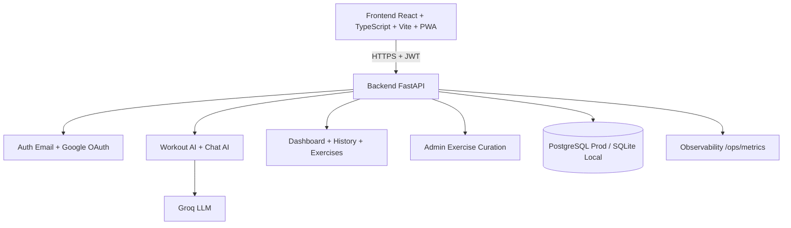

# Boa Forma AI

[](./README.md)
[](./README.en.md)

Production-oriented full stack fitness platform for AI-assisted workout generation, progress tracking, chat assistance, and admin exercise curation.

---

## Recruiter Highlights

- End-to-end product scope: auth, workouts, chat AI, dashboard, history, profile, and admin curation.
- Production-ready architecture: layered backend, database migrations, security controls, and operational runbooks.
- Engineering quality: automated backend tests, CI workflow, and reproducible build checks.
- Operations maturity: monitoring, backup/restore policy, go-live checklist, and rollback strategy.

| Indicator | Status |
|---|---|
| Backend API | ✅ FastAPI modular |
| Frontend App | ✅ React + TypeScript |
| Authentication | ✅ Email + Google + JWT/Refresh |
| Security | ✅ Rate limit + lockout + security headers |
| AI Reliability | ✅ Timeout + retry + fallback |
| Operations | ✅ Runbooks + validation scripts |
| CI | ✅ GitHub Actions |

---

## Tech Stack

### Backend
- Python 3.9
- FastAPI
- SQLAlchemy 2.x
- Alembic
- Pydantic 2 / pydantic-settings
- python-jose (JWT)
- passlib + bcrypt
- Groq SDK (LLM)

### Frontend
- React 19
- TypeScript
- Vite 8
- React Router DOM
- TanStack Query
- Zustand
- React Hook Form + Zod
- Tailwind CSS

---

## Implemented Features

### Product
- AI workout generation with validation and fallback.
- AI chat with persisted history and short conversation memory.
- Dashboard with daily workout, latest workout, stats, and streak.
- Workout history and feedback loop.
- Exercise library (1000 exercises, 16 muscle groups).
- PWA install prompt and offline cache support.

### Authentication & Session
- Email/password signup and login.
- Google OAuth login.
- Refresh token rotation and revocation.
- Session expiration handling in frontend.
- Account linking by email without duplicates.

### Security
- Bcrypt password hashing.
- Brute-force protection on login.
- Rate limiting for login/chat/workout generation.
- Environment-based CORS + Trusted Hosts.
- Security HTTP headers (CSP, HSTS, X-Frame-Options, etc.).

### Operations & Observability
- `/health`, `/ready`, `/ops/metrics`.
- Endpoint-level metrics + AI usage + PWA events.
- Smoke/security/load/CORS/E2E architecture validation scripts.
- Deployment, rollback, backup, cost, and go-live runbooks.

### Admin Curation
- Initial admin panel for exercise management.
- Admin API:
  - `GET /admin/exercises`
  - `POST /admin/exercises`
  - `PATCH /admin/exercises/{exercise_id}`
  - `DELETE /admin/exercises/{exercise_id}`

---

## Architecture



---

## Main Endpoints

### Auth & User
- `POST /users`
- `POST /auth/login`
- `POST /auth/google`
- `POST /auth/refresh`
- `POST /auth/logout`
- `GET /users/me`
- `PATCH /users/me`
- `DELETE /users/me`

### Workouts & History
- `POST /workout/generate`
- `GET /workout/me`
- `GET /workout/{workout_id}`
- `PATCH /workout/{workout_id}/feedback`
- `POST /history`
- `GET /history/me`
- `GET /history/{user_id}`

### Chat
- `POST /chat`
- `GET /chat/history`
- `DELETE /chat/history`

### Exercises
- `GET /exercises`
- `GET /exercises/compatible`
- `GET /exercises/{exercise_id}`
- `GET /admin/exercises`
- `POST /admin/exercises`
- `PATCH /admin/exercises/{exercise_id}`
- `DELETE /admin/exercises/{exercise_id}`

### Operations
- `GET /health`
- `GET /ready`
- `GET /ops/metrics`
- `POST /ops/pwa-events`

---

## Local Run

### Backend

```bash
cd backend
./.venv/bin/pip install -r requirements.txt
./.venv/bin/alembic upgrade head
./.venv/bin/uvicorn app.main:app --reload --host 0.0.0.0 --port 8000
```

### Frontend

```bash
cd frontend
npm ci
npm run dev -- --host 0.0.0.0 --port 3000
```

Local URLs:
- App: `http://localhost:3000`
- API: `http://localhost:8000`
- Swagger: `http://localhost:8000/docs`

---

## Quality Checks

```bash
cd backend
./.venv/bin/python -m unittest discover -s tests -v
./.venv/bin/python -m compileall app scripts

cd ../frontend
npm run build
```

CI workflow:
- [ci.yml](file:///Users/curtoeventos/Desktop/App_Treino_Boa%20Forma/.github/workflows/ci.yml)

---

## Operations Docs

- [DEPLOYMENT_RUNBOOK.md](file:///Users/curtoeventos/Desktop/App_Treino_Boa%20Forma/DEPLOYMENT_RUNBOOK.md)
- [OBSERVABILITY_ALERTING.md](file:///Users/curtoeventos/Desktop/App_Treino_Boa%20Forma/OBSERVABILITY_ALERTING.md)
- [BACKUP_POLICY.md](file:///Users/curtoeventos/Desktop/App_Treino_Boa%20Forma/BACKUP_POLICY.md)
- [GO_LIVE_RUNBOOK.md](file:///Users/curtoeventos/Desktop/App_Treino_Boa%20Forma/GO_LIVE_RUNBOOK.md)

## Go-live Validation Commands

```bash
cd backend
./.venv/bin/python -m scripts.smoke_production --base-url http://localhost:8000
./.venv/bin/python -m scripts.security_check_basic --base-url http://localhost:8000
./.venv/bin/python -m scripts.load_test_api --base-url http://localhost:8000 --requests 100 --concurrency 10
./.venv/bin/python -m scripts.load_test_critical_flows --base-url http://localhost:8000 --users 20 --concurrency 5 --max-p95-ms 3000
```

---

## Author

Developed by Filipi Moraes as a full stack AI fitness platform with strong focus on engineering quality and production readiness.
