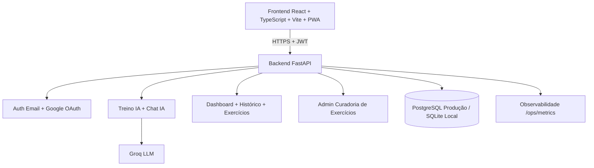

# Academia Boa Forma AI

[](./README.md)
[](./README.en.md)

> Dica: use os botões acima para alternar entre os arquivos PT-BR e EN.


Plataforma full stack para **geração de treinos personalizados com IA**, com foco em segurança, observabilidade, operação de produção e experiência mobile.

Este repositório foi estruturado como projeto real de produto: autenticação robusta, domínio de treino, chat com IA, governança operacional e documentação de go-live.

## Versão em inglês

- README em inglês completo: [README.en.md](file:///Users/curtoeventos/Desktop/App_Treino_Boa%20Forma/README.en.md)

## Recruiter Highlights

- **Escopo completo de produto**: auth, domínio de treino, IA, observabilidade e go-live.
- **Arquitetura production-ready**: separação por camadas, migrations, segurança de API e runbooks operacionais.
- **Qualidade comprovada**: suíte automatizada, CI e validação contínua de build.
- **Maturidade operacional**: backup/restore, monitoramento, checklist de liberação e estratégia de rollback.

| Indicador | Status |
|---|---|
| Backend API | ✅ FastAPI modular |
| Frontend App | ✅ React + TypeScript |
| Autenticação | ✅ Email + Google + JWT/Refresh |
| Segurança | ✅ Rate limit + lockout + headers |
| IA | ✅ Timeout + retry + fallback |
| Operação | ✅ Runbooks + scripts de validação |
| CI | ✅ GitHub Actions |

## Impact Metrics

| Métrica | Valor atual |
|---|---:|
| Exercícios na biblioteca | 1000 |
| Grupos musculares suportados | 16 |
| Testes automatizados backend | 28 |
| Estratégias de resiliência de IA | timeout + retry + fallback |
| Endpoints operacionais | `/health`, `/ready`, `/ops/metrics`, `/ops/pwa-events` |
| Ambientes documentados | dev, staging, produção |

## Plano de evolução (90 dias)

### 0–30 dias
- Evoluir painel admin com busca avançada e filtros compostos.
- Adicionar edição em lote para curadoria de exercícios.
- Implementar trilha de auditoria de alterações no catálogo.

### 31–60 dias
- Expandir analytics de engajamento (funil onboarding, retenção, adoção PWA).
- Criar dashboards executivos para produto e operação.
- Definir SLOs formais de latência e disponibilidade.

### 61–90 dias
- Aprimorar recomendação inteligente com histórico longitudinal.
- Introduzir experimentação controlada (feature flags + A/B básico).
- Fechar loop de feedback com dados de uso real e outcomes de treino.

## Interview Talking Points

- **Arquitetura:** por que separar `routers/services/schemas/models` e como isso reduz acoplamento.
- **Segurança:** como lockout, rate limit e headers mitigam risco em API pública.
- **Resiliência de IA:** decisões de timeout/retry/fallback para manter produto funcional.
- **Operação:** como runbooks e checklists reduzem risco em deploy e go-live.
- **Escalabilidade:** próximos passos para admin em escala, analytics e recomendação.

## Navegação rápida

- [Stack técnico](#stack-técnico)
- [Arquitetura](#arquitetura)
- [Demonstração visual](#demonstração-visual)
- [Endpoints principais](#endpoints-principais)
- [Rodando localmente](#rodando-localmente)
- [Qualidade e validação](#qualidade-e-validação)
- [Produção, operação e go-live](#produção-operação-e-go-live)
- [Architecture Decisions](#architecture-decisions)

---

## Por que este projeto chama atenção em recrutamento

- Arquitetura moderna de ponta a ponta (FastAPI + React + TypeScript + SQLAlchemy + Alembic).
- Fluxos críticos completos: cadastro, login (email + Google), dashboard, treino, histórico, chat e perfil.
- Segurança aplicada de forma prática: JWT, refresh token com rotação, lockout brute force, rate limit, headers de segurança, trusted hosts.
- Operação real de produção: readiness, métricas, smoke tests, validação de CORS/domínio, runbooks, backup/restore e checklist de go-live.
- Qualidade contínua: suíte automatizada de testes + pipeline CI.

---

## Stack técnico

### Backend
- Python 3.9
- FastAPI
- SQLAlchemy 2.x
- Alembic
- Pydantic 2 / pydantic-settings
- python-jose (JWT)
- passlib + bcrypt
- Groq SDK (LLM)

### Frontend
- React 19
- TypeScript
- Vite 8
- React Router DOM
- TanStack Query
- Zustand
- React Hook Form + Zod
- Tailwind CSS

---

## Funcionalidades implementadas

### Produto
- Geração de treino com IA com regras de validação e fallback.
- Chat com IA com histórico e memória básica.
- Dashboard com treino do dia, último treino e estatísticas.
- Histórico de treinos concluídos.
- Biblioteca de exercícios (1000 exercícios, 16 grupos musculares).
- PWA com prompt de instalação e cache offline.

### Autenticação e sessão
- Cadastro e login por email/senha.
- Login social com Google.
- Refresh token com rotação e revogação.
- Controle de sessão expirada no frontend.
- Vinculação de conta social por email sem duplicidade.

### Segurança
- Hash de senha com bcrypt.
- Proteção contra brute force no login.
- Rate limit para login/chat/geração de treino.
- CORS por ambiente + Trusted Hosts.
- Headers de segurança HTTP (CSP, HSTS, X-Frame-Options, etc.).

### Operação e observabilidade
- Endpoints `/health`, `/ready`, `/ops/metrics`.
- Métricas operacionais por endpoint + uso de IA + eventos PWA.
- Scripts de smoke, segurança básica, carga, CORS e validação E2E de arquitetura.
- Runbooks de deploy, rollback, backup, custos e go-live.

### Curadoria admin
- Base inicial de painel admin para exercícios.
- API de curadoria:
  - `GET /admin/exercises`
  - `POST /admin/exercises`
  - `PATCH /admin/exercises/{exercise_id}`
  - `DELETE /admin/exercises/{exercise_id}`

---

## Arquitetura



---

## Endpoints principais

### Auth e usuário
- `POST /users`
- `POST /auth/login`
- `POST /auth/google`
- `POST /auth/refresh`
- `POST /auth/logout`
- `GET /users/me`
- `PATCH /users/me`
- `DELETE /users/me`

### Treino e histórico
- `POST /workout/generate`
- `GET /workout/me`
- `GET /workout/{workout_id}`
- `PATCH /workout/{workout_id}/feedback`
- `POST /history`
- `GET /history/me`
- `GET /history/{user_id}`

### Chat
- `POST /chat`
- `GET /chat/history`
- `DELETE /chat/history`

### Exercícios
- `GET /exercises`
- `GET /exercises/compatible`
- `GET /exercises/{exercise_id}`
- `GET /admin/exercises`
- `POST /admin/exercises`
- `PATCH /admin/exercises/{exercise_id}`
- `DELETE /admin/exercises/{exercise_id}`

### Operação
- `GET /health`
- `GET /ready`
- `GET /ops/metrics`
- `POST /ops/pwa-events`

---

## Rodando localmente

### 1) Backend

```bash
cd backend
./.venv/bin/pip install -r requirements.txt
./.venv/bin/alembic upgrade head
./.venv/bin/uvicorn app.main:app --reload --host 0.0.0.0 --port 8000
```

### 2) Frontend

```bash
cd frontend
npm ci
npm run dev -- --host 0.0.0.0 --port 3000
```

### URLs locais
- App: `http://localhost:3000`
- API: `http://localhost:8000`
- Swagger: `http://localhost:8000/docs`

---

## Qualidade e validação

Comandos usados no projeto:

```bash
cd backend
./.venv/bin/python -m unittest discover -s tests -v
./.venv/bin/python -m compileall app scripts

cd ../frontend
npm run build
```

Pipeline CI:
- [ci.yml](file:///Users/curtoeventos/Desktop/App_Treino_Boa%20Forma/.github/workflows/ci.yml)

---

## Produção, operação e go-live

Documentos operacionais:
- [DEPLOYMENT_RUNBOOK.md](file:///Users/curtoeventos/Desktop/App_Treino_Boa%20Forma/DEPLOYMENT_RUNBOOK.md)
- [OBSERVABILITY_ALERTING.md](file:///Users/curtoeventos/Desktop/App_Treino_Boa%20Forma/OBSERVABILITY_ALERTING.md)
- [BACKUP_POLICY.md](file:///Users/curtoeventos/Desktop/App_Treino_Boa%20Forma/BACKUP_POLICY.md)
- [DOMAIN_SSL_SETUP.md](file:///Users/curtoeventos/Desktop/App_Treino_Boa%20Forma/DOMAIN_SSL_SETUP.md)
- [CLOUDFLARE_PROVISIONING.md](file:///Users/curtoeventos/Desktop/App_Treino_Boa%20Forma/CLOUDFLARE_PROVISIONING.md)
- [GOOGLE_CLOUD_OAUTH_SETUP.md](file:///Users/curtoeventos/Desktop/App_Treino_Boa%20Forma/GOOGLE_CLOUD_OAUTH_SETUP.md)
- [GO_LIVE_CHECKLIST.md](file:///Users/curtoeventos/Desktop/App_Treino_Boa%20Forma/GO_LIVE_CHECKLIST.md)
- [GO_LIVE_RUNBOOK.md](file:///Users/curtoeventos/Desktop/App_Treino_Boa%20Forma/GO_LIVE_RUNBOOK.md)

---

## Diferenciais técnicos

- Projeto orientado a produto real, não apenas CRUD.
- Estratégia de resiliência para IA (timeout, retry, fallback).
- Segurança e operação tratados como primeira classe.
- Documentação de engenharia com padrão profissional.
- Base admin para curadoria da biblioteca de exercícios com controle de acesso.
- Métricas de engajamento PWA rastreadas e consolidadas no backend.

---

## Architecture Decisions

Resumo das decisões arquiteturais no formato ADR:
- [ARCHITECTURE_DECISIONS.md](file:///Users/curtoeventos/Desktop/App_Treino_Boa%20Forma/docs/ARCHITECTURE_DECISIONS.md)

---

## Roadmap

- Evoluir painel admin com busca avançada, edição em lote e auditoria.
- Expandir analytics de engajamento para decisões de produto.
- Aprimorar recomendações inteligentes com histórico longitudinal.

---

## Autor

Projeto desenvolvido por Filipi Moraes como plataforma full stack de treino com IA, com foco em qualidade de engenharia e prontidão de produção.

---

## 🇧🇷 Versão em Português

Este README principal está em português e cobre:
- visão de produto e engenharia
- stack técnica
- arquitetura
- funcionalidades implementadas
- execução local
- qualidade e validação
- operação de produção e go-live
- roadmap

Use o botão no topo para pular para a versão em inglês.

---

## 🇺🇸 English Version

### Overview

Boa Forma AI is a production-oriented full stack fitness platform focused on AI-assisted workout generation, secure authentication, operational readiness, and mobile-first UX.

### Recruiter Highlights

- End-to-end product scope: auth, workouts, chat AI, dashboard, history, admin curation.
- Production-ready architecture: layered backend, migrations, security controls, and runbooks.
- Engineering quality: automated tests, CI pipeline, and validated build workflows.
- Operations maturity: monitoring, backup/restore policy, go-live checklist, rollback strategy.

### Tech Stack

**Backend**
- Python 3.9, FastAPI, SQLAlchemy 2.x, Alembic
- Pydantic 2, python-jose (JWT), passlib/bcrypt
- Groq SDK (LLM)

**Frontend**
- React 19, TypeScript, Vite 8
- React Router, TanStack Query, Zustand
- React Hook Form + Zod, Tailwind CSS

### Main Features

- AI workout generation with validation and fallback.
- AI chat with persisted history.
- Dashboard with stats and streak.
- Workout history and feedback loop.
- Exercise library (1000 items, 16 muscle groups).
- Admin exercise curation endpoints.
- PWA install prompt + offline cache + engagement metrics.

### Core Endpoints

- Auth: `/users`, `/auth/login`, `/auth/google`, `/auth/refresh`, `/auth/logout`
- User: `/users/me` (`GET`, `PATCH`, `DELETE`)
- Workouts: `/workout/generate`, `/workout/me`, `/workout/{id}`, `/workout/{id}/feedback`
- History: `/history`, `/history/me`, `/history/{user_id}`
- Chat: `/chat`, `/chat/history`
- Exercises: `/exercises`, `/exercises/compatible`, `/admin/exercises`
- Ops: `/health`, `/ready`, `/ops/metrics`, `/ops/pwa-events`

### Local Run

```bash
cd backend
./.venv/bin/pip install -r requirements.txt
./.venv/bin/alembic upgrade head
./.venv/bin/uvicorn app.main:app --reload --host 0.0.0.0 --port 8000

cd ../frontend
npm ci
npm run dev -- --host 0.0.0.0 --port 3000
```

### Quality Checks

```bash
cd backend
./.venv/bin/python -m unittest discover -s tests -v
./.venv/bin/python -m compileall app scripts

cd ../frontend
npm run build
```

CI workflow:
- [ci.yml](file:///Users/curtoeventos/Desktop/App_Treino_Boa%20Forma/.github/workflows/ci.yml)

### Production Operations

- Deployment and rollback: [DEPLOYMENT_RUNBOOK.md](file:///Users/curtoeventos/Desktop/App_Treino_Boa%20Forma/DEPLOYMENT_RUNBOOK.md)
- Monitoring and alerts: [OBSERVABILITY_ALERTING.md](file:///Users/curtoeventos/Desktop/App_Treino_Boa%20Forma/OBSERVABILITY_ALERTING.md)
- Backup and recovery: [BACKUP_POLICY.md](file:///Users/curtoeventos/Desktop/App_Treino_Boa%20Forma/BACKUP_POLICY.md)
- Go-live process: [GO_LIVE_RUNBOOK.md](file:///Users/curtoeventos/Desktop/App_Treino_Boa%20Forma/GO_LIVE_RUNBOOK.md)

### Go-live Validation Commands

```bash
cd backend
./.venv/bin/python -m scripts.smoke_production --base-url http://localhost:8000
./.venv/bin/python -m scripts.security_check_basic --base-url http://localhost:8000
./.venv/bin/python -m scripts.load_test_api --base-url http://localhost:8000 --requests 100 --concurrency 10
./.venv/bin/python -m scripts.load_test_critical_flows --base-url http://localhost:8000 --users 20 --concurrency 5 --max-p95-ms 3000
```

### Neon Connection (Projeto Aplicativo_Boa Forma)

```bash
cd backend
export NEON_DATABASE_URL="postgresql://<user>:<password>@<endpoint>.neon.tech/<database>?sslmode=require"
./.venv/bin/python -m scripts.configure_neon_connection
./.venv/bin/alembic upgrade head
```

---
